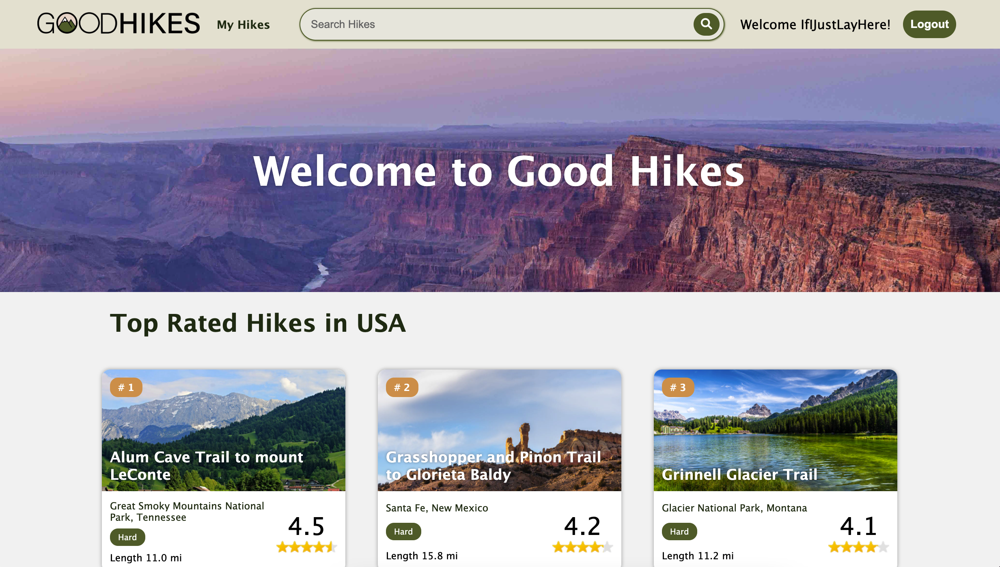
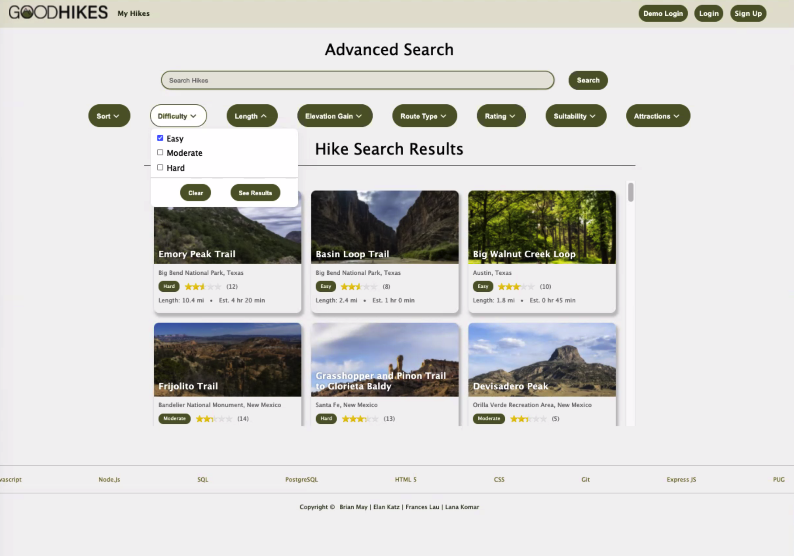
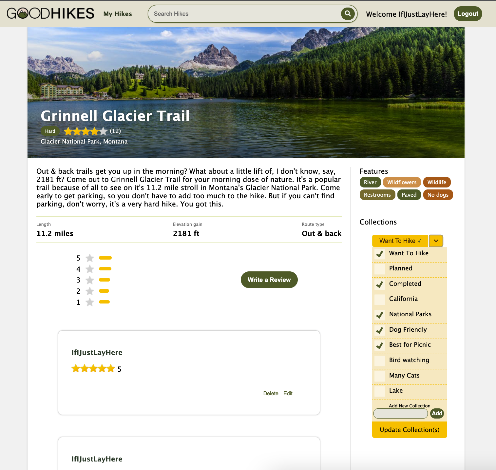
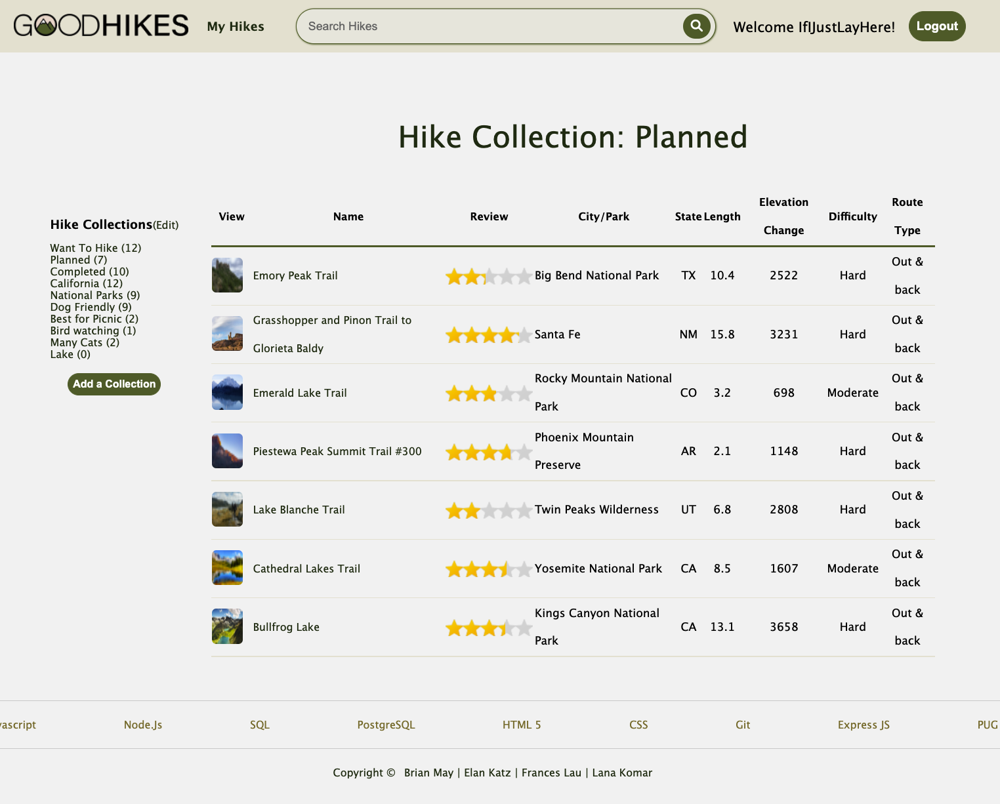

# Good Hikes

Good Hikes https://good-hikes.herokuapp.com/

 **_Home Page_**

 **_Advanced Search Page_** - search by city name, trail name, sorting and multiple filters.

 **_Hike Page_** - with review function and dropdown for adding hikes to user's collections

 **_My Hikes Page_** - organizing collections of hikes

Git Wiki https://github.com/frances-y-h/good-hikes/wiki

## Good Hikes at a Glance

Good Hikes is a full stack application that allows users to browse, manage, and review hikes. Users are not required to sign up for an account if they are just browsing and searching for hikes. Logged in users can add a hike to their collections, add reviews/comments to hikes, and edit/delete their own review/comments. Currently, Good Hikes is seeded with 60 trails all over the United States. User `IfIJustLayHere` loves Good Hikes so much that they visited every trail on Good Hikes and left mutiple comments on each.

## Getting Development Environment Up And Running
- Git Clone the repo to your local machine
- Install Dependencies:  run: 'npm install'
- Create a '.env' file that mirrors the '.env.example' file
- Create a user in your local postgreSQL database
- Then use the 'npx dotenv sequelize [suffix]' command with each suffix in order: 'create:db', 'db:migrate', 'db:seed:all'
- Start server: run: npm start

## Application Architecture

Good Hikes is built on Pug frontend with an Express backend, using PostgreSQL as a database.

## Frontend Overview

Good Hikes depends on backend for queries and routes, but implemented frontend interactions to improve user experience.

### Frontend Technologies Used

#### Pug

Web pages of Good Hikes are rendered by Pug.js, a template engine for Node.js and browers. It creates dynamic reusable content.

#### CSS

Good Hikes uses CSS to style all of the HTML documents, including interactive buttons and dropdown menus.

#### Javacript

To improve user experience, Good Hikes uses Javacript to create a responsive experiance.

### Backend Overview

Good Hikes uses an Express server with PostgreSQL database. Good Hikes also implemented features to protect user's password and information.

#### Express.js

The server of Good Hikes is set up with Express JS. It is minimal and flexible enough to carry out the desired functionality while maintining the code dry.

#### Express session

Good Hikes choose to use Express Sessions to create and manage session cookies on users browser.

#### Express Validator

Express Validator is powerful yet simple. Good Hikes makes sure when users are signing up, logging in, and creating new reviews, proper values have been inserted.

#### PostgreSQL

Good Hikes relies on PostgreSQL to maintain its relational database.

#### Sequelize

Sequelize makes it easy for Good Hikes to manage and query the database

#### bcrypt

Good Hikes values the security of users' passwords, that is why all of the passwords has been hashed by bcrypt before storing them into the database.

#### CSRF Token

A secure random CSRF token is generated on all forms that users fill in to prevent CSRF attacks.

##Challenges and Solutions
BRAINSTORM TO BE EXANDED ON: 
- Database setup 
  - Missing associating in sequelize model - database setup 
- USER Auth Feature
  - Demo - form submission vs ajax and window refresh fetch stops the default refresh behavior
  - csurf form submission issues
  - requireAuth middleware
- Home page Feature
-   raw sequel queries + sequelize, missing association
- Search Feature
  - utilizing mixins to solve repetive html issues
  - re-populate the data fields
  - -clear button functionality
- Collections Feature
  - add to collection dropdown
  - as added more dom manipulation, some buttons dissapeared, better organization on selectors
  - deleting collections with associated data,
- Reviews Feature
  - adding event listeners to buttons created in front end post fetch request
  - merge conflict doubled the router code
  - updating the table after adding a review without rerendering. parent./child node (delete last and add first) vs fetch to datbase and refill entire table
  - re-populate and clear the data field
- Git and version contol
  - learning curve about branches, and rebasing, and merging, and pull requests
- Product
  - new to heroku, and learning about production errors and heroku cli
  - 

## Conclusion and Next Steps

The next step for Good Hikes is to build a social network, including "Friends" and "Hiking Communities". Registered users can join communities, schedule hiking events, create posts on community pages.

Good Hikes also plans to implement a "Likes" feature to comments. Helpful comments will be rated higher. Our goal is to boost interactivity between users.
